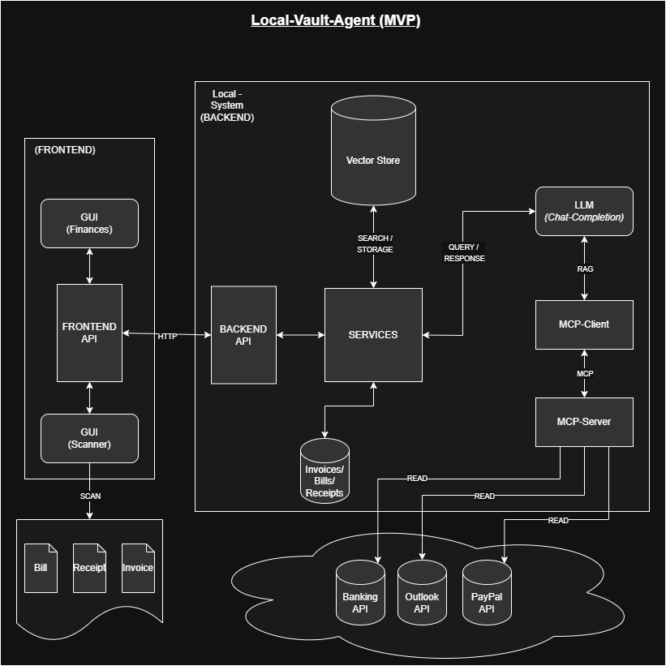

# LocalVaultAgent
## Repository
This repository is a monorepo for all software products that combine to the LocalVaultAgent solution as described [here](https://monorepo.tools/).
This project is about developing an AI System that allows users to process sensitive and personal data without sharing it with any third parties.  It's supposed to run locally on any average computer or home-server.   

## LocalVaultAgent Big-Picture MVP (Minimum Viable Product):
### The MVP of this project has been defined as a finance app that can find and retrieve any information about bills, payments and deadlines. The data to do so can come from various different sources and is processed by LLMs to search for relevant information in unstructured data. 

